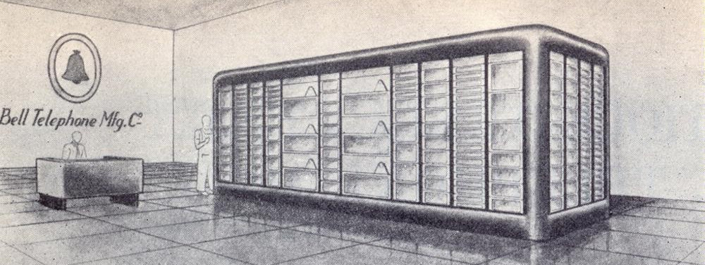

# IRSIA-FNRS Mathematical Machine - Machine Mathématique IRSIA FNRS (MMIF)

This repo aims at gathering key material to understand the IRSIA-FNRS Mathematical Machine (Machine Mathematique IRSIA-FNRS in French, MMIF for short).  
Based vacumm tube technology, this pioneering machine is among the few first generation national computers of Europe.
It was designed in the Bell Telephone Manufacturing company in Antwerpen from 1946 to 1955 and then operated until 1962, mainly for scientific research.

The MMIF has many interesting features such as:
* Harvard kind of architecture which separates program and data on two different drums
* early instruction set and assembly language
* calculating unit "groupe calculateur" with high precision floating point (15 digits mantissa) operation (+,-,*) operating in decimal format
* possibility to operate in fixed point and double precision
* mathematical library to efficiently compute all scientific functions (division, trigonometric, exponential, logarithms, root extraction)
* inputs and outputs to drums, tapes, console and printer
* software-level reliability management
* bi-quinary encoding at hardware level

The repository mainly gathers:
* key documents related to the machine including technical docs from the 1950's and later studies on the machine
* a simulator for understanding the dynamics of the machine  
* (planned) a 3D model of the machine

## Documents

The repository gathers the following types of documents in the [docs](docs) directory
* technical documents related to the machine that were not released on the Internet until now (e.g. manuals, pseudocode, problem list)
* some pictures and representations of the machine
* papers related to the technology and algorithms used by the MMIF and other mathematical machines for comparison purposes
* later documents analysing the machine (scientific articles, books), either reference or downloadable when 

Note those documents are hosted here but also available on [archive.org](https://archive.org/details/mmif-tech-doc)

## More technical details

* [Memory and Registers](mem-reg.md)
* [Instruction set](instructions.md)

## Simulator/Disassembler

A python simulator is available in the [src](src) directory. This is work in progress with the following supported features
* support of main instructions: memory transfer with drums, floating point operations and alteration, comparison, jumps, alarms
* disassembly of memory dumps
* running with breakpoints and stepping
* demo code from the internal math library
* low-level bi-quinary representation

Not yet supported:
* fixed point and double precision arithmetic
* tape and printer operation
* more accurate implementation of floating point operations closer to the calculating unit
* investigation on some incomplete description of machine behaviour
* more code examples
* failure injection

### Installing and running the simulator
* just clone repository and install some required references
* launch main.py
* by default an inverse function is launched
* breakpoint need to be set using "m.set_breakpoint(XXXX)" where XXXX is address, multiple of 5
* when hitting a break point hit return in console to continue in stepping mode, type r+return to stop stepping

### Example: inverse function, tape utils and more

some material is available in this [examples directory](examples)
for each example, we typically provide
* code dump (picture from manual)
* documented assembly
* disassembly from simulator
* running trace computing 1/4 = 0.25

### Interesting/Fun facts to elaborate

* reason for biquinary encoding
* decimal vs binary operation, some impact (e.g. 0+ and 0-)
* early electronics reliability (vacuum tubes)
* no division in calculating unit
* is there a clock ? do all operations take the same time ?

## References (by chronological order)

* 1947 - About Mathematical Machines by Léon Brillouin (in French)
* 1956 - About Core Functions by Vitold Belevitch (in French)
* 1957 - CECE document 1 - manuel de programmation (in French)
* 1958 - CECE document 2 - pseudo-code Manual (in English)
* 1959 - MKII document 4 - about elementary functions (in French)
* 2008 - MMIF slides by Sandra Mols (in English)
* 2010 - Account on the Machine by Pierre-Jacques Courtoy (in English)
* 2010 - MMIF Book by Marie Gevers (in French)
* 2014 - MMIF summary paper by Marie Gevers (in Engligh)
